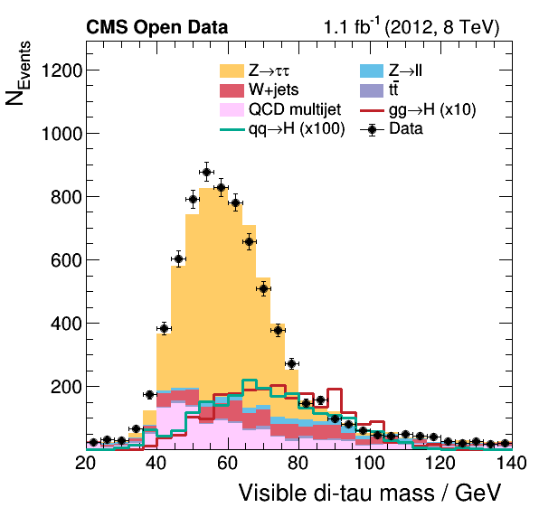

# Example analysis for the analysis preservation bootcamp

The example is an educational version of a Higgs to two tau lepton analysis based on NanoAOD-like samples from the CERN Open Data portal. To fit the computational effort of the analysis in the scope of the workshop, the samples are reduced beforehand. See the documentation below for the single steps.

Features:
- The analysis has the common steps of skimming, histogramming and plotting/fitting
- The skimming and histogramming workflow is parallelized on file basis and all results are just merged for the plotting or fitting.
- No experiment specific software needed, no experiment policies attached to the data or code.
- Minimal software dependencies (ROOT and Python), running on all major CERN infrastructure (lxplus, SWAN, all CVMFS enabled machines)
- The analysis workflow is scripted in bash so we can transfer this during the workshop to any workflow management software such as ReANA.

## Links

Indico agenda of the event: https://indico.cern.ch/event/854880/
Record on the CERN Open Data portal used as baseline: http://opendata.web.cern.ch/record/12350

## Dependencies

The analysis needs only ROOT (6.16 or later) and Python (2 and 3 should work). You can run on any CVMFS enabled machine sourcing the following LCG release (don't forget to select the correct platform):

```bash
source /cvmfs/sft.cern.ch/lcg/views/LCG_95/x86_64-slc6-gcc8-opt/setup.sh
```

Other ways to install ROOT:
- You can install ROOT via conda on most machines in a few minutes: https://anaconda.org/conda-forge/root
- You can follow the instructions from the ROOT website for binaries and CVMFS sources: https://root.cern.ch/content/release-61804
- Or use the pacakges from your distro (highly depends on the distro whether this works out...)

## Preprocessing: Reducing the initial samples

To reduce the inital samples to a fraction of the size, call the bash script `reduce.sh`, which processes all relevant samples with a constant reduction factor.

## Runtime

Data: Locally on an SSD, 6.5GB, 10% of the original samples, represents data and simulation of about 1.1fb-1 of the data taken in 2012 with CMS
System: Consumer laptop, single core, on reduced initial samples, everything fully sequentially

Skimming: 2m30s
Histograms: 40s
Plotting: Instant
Fit: Almost instant

Note that skimming and histogram production can be run seamlessly in multi-threading mode. I removed the feature for now so that we don't break any workflow later on (containe, ReANA, ...) but we could improve the runtime by a factor of around N (N being the number of threads used / physical cores).

## Step 1: Skimming

The first analysis step skims the NanoAOD-like samples with a baseline selection and finds valid muon-tau pairs. The output is written as a flat ntuple for further processing. Run `bash skim.sh /path/to/dir/with/samples` to skim all (reduced) samples.

## Step 2: Histograms

Next, we make histograms of all variables and physics processes for later plotting. Call `bash histograms.sh /path/to/dir/with/skims` to run the workflow.

## Step 3: Plotting

Finally, we make the physics results by combining the histograms. Run `bash plot.sh /path/to/histograms.root /path/to/output/dir` for this step.

The resulting plots are added to this repository as reference, e.g., see here the visible mass of the di-tau system:



## Step 4: Fit
Optionally, we can fit the cross-section of any process using the histograms also used for plotting.

TODO: Add the fitting script
